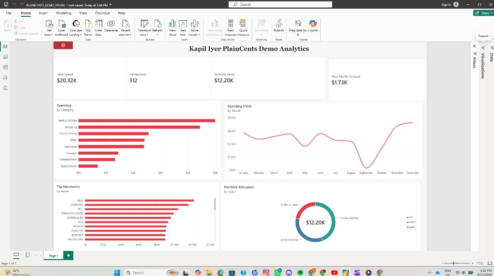

# PlainCents

A full-stack personal finance analytics app: import Canadian bank CSVs, categorize spending with classical ML and human corrections, explore dashboards and forecasts, track a small portfolio, and export a Power BI–ready data pack.

**[Live app](https://plaincents.onrender.com)** · **[Watch the demo](https://www.youtube.com/watch?v=PxNN2qKE-b4)** · **[Architecture docs](docs/)**

Deployed on Render (FastAPI serves `/api/*` and the built React SPA). Hosted SQLite is **ephemeral** portfolio/demo storage: no auth, not a production banking product.

---

## What PlainCents does

1. **Ingest** RBC / Scotiabank / TD / CIBC CSV exports (Preview → Confirm, bank-aware dedup).
2. **Classify spending eligibility** so clear same-owner account transfers are not counted as spend.
3. **Categorize** merchant text with TF-IDF + Logistic Regression, conservative abstention when uncertain, and structural rules for purposeless rows.
4. **Correct** categories in-app; **correction memory** reuses genuine human confirmations for the same merchant + bank.
5. **Analyze** monthly spend, pace, movers, category breakdown, trends, and Insights.
6. **Forecast** next-three-month category spend with a 3-month rolling mean (evidence-selected, not fancy ML).
7. **Track holdings** with optional cost basis and Yahoo Finance quotes (1-hour cache).
8. **Export** a point-in-time Power BI data pack (four CSVs + setup docs/theme).

In-app: EMPTY / DEMO / REAL modes, a guided product tour, and a How It Works methodology walkthrough.

---

## Demo

- **Video:** [https://www.youtube.com/watch?v=PxNN2qKE-b4](https://www.youtube.com/watch?v=PxNN2qKE-b4)
- **Live:** [https://plaincents.onrender.com](https://plaincents.onrender.com) (cold start may take a moment on free Render)
- **In-app Demo mode:** deterministic sample transactions, forecast, and holdings, clearly labeled Demo. Mutually exclusive with real imports.

---

## Architecture

```
React + TypeScript (Vite)
        ↓ REST
FastAPI  (/api/* + built SPA in production)
        ↓
services → repositories → SQLite
        ↘ ML categorizer + rolling-mean forecast + yfinance cache
```

| Layer | Location |
|---|---|
| Frontend | `frontend/` — React, TanStack Query, Recharts |
| Backend | `backend/` — routes → services → repositories |
| ML / eval | `ml/`, `reports/ml/`, artifact `models/categorizer_v3.pkl` (gitignored; build via script) |
| Banks | `pipeline/ingest.py` adapters |
| Power BI starter | `powerbi/v2/` |

---

## Transaction pipeline

```
Bank CSV
  → normalize + bank fingerprint
  → Preview / Confirm (dedup)
  → spending eligibility (internal account transfer?)
  → structural / e-transfer policy / gazetteer / ML
  → abstain to Other + Suggested category when low confidence
  → human confirm / correct
  → correction memory on later imports
  → effective_category drives analytics & forecast
```

**Internal transfers:** clear bank account-to-account mechanism text with no residual recipient identity can be stored as `transaction_type = internal_transfer`. Those rows stay visible in Transactions as “Internal transfer,” but are excluded from spend totals, dashboard analytics, forecast inputs, and Power BI spending summaries. **Interac e-Transfers are not blanket-excluded** (a name is not proof of self-transfer).

**Dashboard month:** if the calendar month has no imported rows, the UI defaults to the latest populated month instead of showing fake \$0 / −100% spend.

---

## ML categorization

| | |
|---|---|
| Model | Word + character TF-IDF → Logistic Regression (`categorizer_v3.pkl`) |
| Decision path | Shared `category_decision.decide()` for Import Preview, Confirm, and manual add |
| Abstention | Low margin / no features → served as Other; advisory `model_category` may power Suggested / Use |
| Human loop | `confirmed_category` wins; no online retraining from clicks |

**Held-out, privacy-safe deployment-oriented benchmark** (fabricated merchants; not real-world accuracy):

| Metric | Value | Source |
|---|---|---|
| Prior weak sealed macro-F1 | ~0.174 | `reports/ml/ML_F_SELECTION_RECORD.json` |
| Current model sealed macro-F1 | ~0.593 | `reports/ml/ML_G_SELECTION_RECORD.json` |
| With abstention policy | ~0.576 | same |

Resume-safe line: improved held-out deployment-oriented categorization macro-F1 from about **0.17 to 0.59** by redesigning the privacy-safe training corpus and adding conservative abstention. Do not call this “accuracy” or production accuracy.

Evidence and caveats: `reports/ml/`.

---

## Forecasting

Shipped method: **3-month rolling mean** of category spend (`mean` of up to the last three observed months per category). Same value for +1/+2/+3 horizons by design. Uses `effective_category` and **excludes internal transfers**.

Selected over Naive / Ridge / Random Forest / EWMA via temporal validation on synthetic monthly series (`reports/ml/ML_F_SELECTION_RECORD.json`, `reports/ml/results/ml_f_final_forecasting.json`):

| | Combined WAPE (sealed synthetic FINAL period) |
|---|---|
| Rolling mean (3) | ~0.178 |
| Naive (ML-C FINAL reference) | ~0.189 |

Not real-world forecast accuracy. The simple method was kept because evaluation supported it.

---

## Portfolio

- Holdings with optional average cost; P&L is **null** when cost is unknown (never fabricated as \$0).
- Quotes from **Yahoo Finance** (`yfinance`) only on **Refresh Prices**; backend cache TTL **3600s (1 hour)**.
- Demo holdings use a labeled deterministic snapshot until a real refresh is requested.
- Not real-time / streaming prices.

---

## Power BI export

PlainCents does **not** embed a live Power BI report. Dashboard → **Export for Power BI** calls the API and downloads a **point-in-time** ZIP:

| File | Role |
|---|---|
| `transactions.csv` | Rows including eligibility fields (`transaction_type`, `included_in_spending`) |
| `category_summary.csv` | Spend summaries (internal transfers excluded) |
| `portfolio.csv` | Holdings snapshot |
| `forecast.csv` | Latest forecast (spending-only inputs) |

Starter docs and theme: [`powerbi/v2/`](powerbi/v2/). Schema notes: [`powerbi/v2/SCHEMA.md`](powerbi/v2/SCHEMA.md).

A Power BI Desktop dashboard was built from the **current PlainCents V2 demo export** (KPI cards, category spend, monthly trend, top merchants, portfolio allocation, next-month forecast):



*Power BI dashboard built directly from the PlainCents V2 demo export.*

---

## Supported banks

| Bank | Status |
|---|---|
| RBC | Actual-export verified |
| Scotiabank | Actual-export verified |
| TD | Project-verified (headerless-format limits disclosed) |
| CIBC | Research-backed; fail-closed where ambiguous |
| BMO | Coming soon |
| National Bank | Coming soon |

Not universal Big Six coverage; not every product/account variant of a supported bank.

---

## Demo / deployment notes

- Modes: **EMPTY**, **DEMO**, **REAL**.
- Render demo: Python 3.12 + Node 20 build; `GET /api/health` reports DB + categorizer + mode.
- Hosted SQLite resets with the instance; treat the deploy as a **portfolio demo**, not persistent personal banking storage.
- No signup / auth. Outbound network: Yahoo Finance on Portfolio refresh only (plus whatever the host needs to serve the app).

---

## Testing / validation

| Suite | Command | Verified this audit |
|---|---|---|
| Backend + ML tests (pytest) | `.venv` + `pytest` (ignore untracked private_eval scripts) | **705 passed** |
| Frontend (Vitest) | `cd frontend && npm test` | **181 tests** (one How It Works case flaked once under load; passed on re-run of that file) |
| Categorizer bake-off | `reports/ml/ML_G_SELECTION_RECORD.json` | macro-F1 as above |
| Forecast bake-off | `reports/ml/results/ml_f_final_forecasting.json` | WAPE as above |

E2E (Playwright) lives at repo root (`npm run e2e`); not re-run in this README pass.

```bash
python tests/fixtures/build_test_categorizer_model.py   # once per clone
pytest
cd frontend && npm test
```

---

## Run locally

**Prerequisites:** Python 3.11+ (3.12 fine), Node 20+, npm.

```bash
pip install -r requirements.txt
cp .env.example .env    # optional
cd frontend && npm install && cd ..

# optional: production categorizer for real CSV import
python -m scripts.build_production_categorizer

# one-process reviewer mode (builds SPA if needed)
python -m backend.scripts.run_reviewer
# → http://127.0.0.1:8000
```

Dev (two terminals):

```bash
uvicorn backend.main:app --reload          # :8000
cd frontend && npm run dev                 # :5173, proxies /api
```

---

## Limitations

- Categorization metrics are **deployment-oriented / privacy-safe**, not labeled real-world bank accuracy.
- Many real e-transfers lack spend-purpose text and land in Other (still counted as spending unless they are clear internal account transfers).
- Forecast is intentionally a **rolling mean**, not personalized deep learning.
- Portfolio prices are **cached / latest-known**, not live streaming.
- Hosted demo DB is **ephemeral**; no multi-user auth or bank-grade security claims.
- Not investment, tax, or banking advice; no payment execution.

---

## Tech stack

Python · TypeScript · React · FastAPI · scikit-learn · SQLite · Pandas · yfinance · Power BI · Render

---

## V1 note

An older batch pipeline (`main.py`, K-Means / Random Forest diagnostics, `viz/`) remains in-repo for history. **V2 is the product.** V1 synthetic accuracy/MAPE figures are not claims about the shipped app.

---

## Author

**Kapil Iyer**  
BMath (Honours), University of Waterloo · Applied Mathematics (Scientific ML) & Statistics, Computing Minor

[GitHub](https://github.com/Kapil-Iyer) · [Portfolio](https://kapil-iyer-portfolio.vercel.app/)
